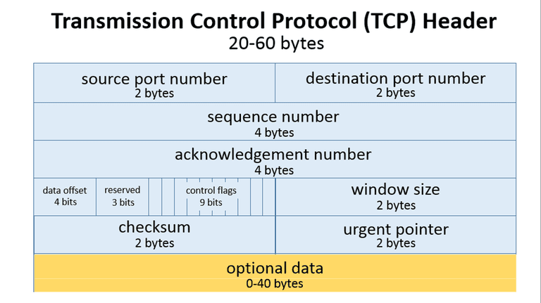

# Tugas Besar Jarkom IF3130 : Sliding Window

## Petunjuk Penggunaan

## Cara Kerja Sliding Window

## Pembagian Tugas

## Soal 
1. Apa yang terjadi jika advertised window yang dikirim bernilai 0? Apa cara untuk menangani hal tersebut?
2. Sebutkan field data yang terdapat TCP Header serta ukurannya, ilustrasikan, dan jelaskan kegunaan dari masing-masing field data tersebut!

## Jawaban

1. Jika advertised window bernilai 0, maka data tidak akan bisa lagi diterima. Proses pengiriman diberhentikan sementara dan client pun harus menunggu hingga advertised window tidak berukuran 0. Untunk menangani hal ini, seperti yang telah disebutkan, karena window berukuran 0 maka data tidak akan bisa diterima. Akan tetapi, sender hanya perlu terus terusan berusaha mengirimkan data. Dengan begitu, akan memacu ukuran window yang ditawarkan client yang pada akhirnya ukuran windownya berubah menjadi tidak 0.

2. Field Data TCP Header
    * Source TCP port number (2 bytes)
    * Destination TCP port number (2 bytes)
    * Sequence number (4 bytes)
    * Acknowledgment number (4 bytes)
    * TCP data offset (4 bits)
    * Reserved data (3 bits)
    * Control flags (up to 9 bits)
    * Window size (2 bytes)
    * TCP checksum (2 bytes)
    * Urgent pointer (2 bytes)
    * TCP optional data (0-40 bytes)
    
    Ke-sebelas field data tersebut diatur sehingga membentuk tatanan field data seperti berikut:
    
    ### Ilustrasi Field Data TCP Header 
    
    
    ### Fungsi Tiap Field Data
    * **Source and Destination TCP port number  **
        Titik akhir komunikasi untuk mengirim dan menerima devices
    * **Sequence number  **
        Pengirim pesan menggunakan sequence numbers untuk menandakan urutan dari sekumpulan pesan. 
    * **Acknowledgment number  **
        Senders dan  receivers menggunakan acknowledgment number untuk memberitahukan urutan dari pesan yang diterima atau yang akan dikirim
    * **TCP data offset  **
        Menyimpan ukuran total dari TCP Header dalam kelipatan 4 bytes.
    * **Reserved data  **
        Reserved data pada TCP header selalu mempunyai nilai nol. Field ini bertujuan untuk mengatur total dari ukuran header menjadi kelipatan 4 bytes(penting untuk efisiensi dalam memproses data).
    * **Control flags  **
        TCP menggunakan control flags untuk mengatur flow data dalam situasi yang spesifik. Contoh, satu bit flag untuk menginisiasi logika dalam mereset koneksi TCP
    * **Window size  **
        Pengirim pesan menggunakan nilai window size untuk menentukan sebanyak apa data yang dikirim kepada receiver sebelum menerima feedback berupa ack. Jika window size terlalu kecil, pengiriman data akan berlangsung lambat tetapi jika window size terlalu besar, receiver mungkin tidak bisa menerima data yang terlalu cepat sehingga data mungkin corrupt.
    * **TCP checksum  **
        Nilai checksum dalam TCP header diambil dari protocol sender untuk membantu receiver mendeteksi pesan yang corrupt.
    * **Urgent pointer  **
        Field ini sering diatur nilainya menjadi nol atau diabaikan, tetapi bersamaan dengan salah satu dari control flag, field ini dapat digunakan sebagai data offset untuk menandakan subset dari sebuah pesan yang membutuhkan prioritas dalam memprosesnya.
    * TCP optional data  
      
